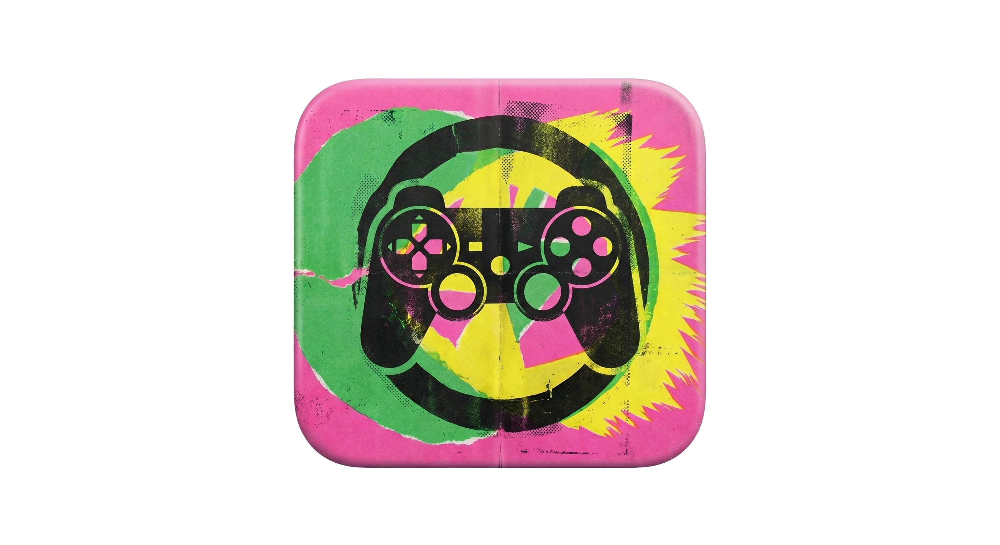

# ReShadeLinux



**Install the official ReShade runtime for Wine and Proton games on Linux.**

Automatic Steam game detection, per-game shader selection, AppImage packaging, and a CLI path for scripted installs.

| Version | License | Delivery |
| --- | --- | --- |
| See [CHANGELOG.md](CHANGELOG.md) | [GPL-2.0-or-later](LICENSE) | AppImage or source checkout |

## Understand credit and scope

> [!IMPORTANT]
> ReShade itself is created and maintained by [crosire](https://reshade.me/) and the wider ReShade contributor community. This repository does not replace ReShade. It automates downloading the official ReShade release, selecting shader packs, and wiring everything into Wine or Proton game installs on Linux.
> [!NOTE]
> This project continues the work started in [kevinlekiller/reshade-steam-proton](https://github.com/kevinlekiller/reshade-steam-proton). Credit for the original Linux installer flow belongs to [kevinlekiller](https://github.com/kevinlekiller). Credit for ReShade itself belongs to [crosire](https://github.com/crosire) and ReShade contributors.

## Start with the AppImage

Download the latest AppImage from the [Releases](https://github.com/asafelobotomy/reshadelinux/releases) page.

```bash
chmod +x reshadelinux-*-x86_64.AppImage
./reshadelinux-*-x86_64.AppImage
```

The AppImage bundles the launcher and project scripts. The first run still downloads the official ReShade payload from [reshade.me](https://reshade.me/).

## Run from source

Install `grep`, `7z`, `curl`, `git`, `file`, `python3`, `sed`, and `sha256sum`.

```bash
git clone https://github.com/asafelobotomy/reshadelinux.git
cd reshadelinux
./reshadelinux.sh
```

Install `yad` when you want the graphical flow. If `yad` is unavailable, the script falls back to `whiptail`, then `dialog`, then plain CLI prompts.

## See what the installer handles

| Capability | What it does |
| --- | --- |
| Steam detection | Scans every Steam library and reads `appinfo.vdf` metadata to find the real launch executable. |
| DLL selection | Uses PE import analysis to choose the most likely ReShade hook such as `dxgi`, `d3d9`, `opengl32`, `ddraw`, or `dinput8`. |
| Per-game state | Saves DLL, architecture, path, App ID, and selected shader repos per game in `~/.local/share/reshade/game-state/`. |
| Shader curation | Lets each game keep its own selected shader packs while still linking shared `.fxh` headers needed for compile-time includes. |
| Prefix support | Detects the right Wine or Proton prefix and installs `d3dcompiler_47.dll` where ReShade 6.5+ expects it. |
| Repeat updates | Reuses tracked state for reinstall runs and supports `--update-all` for every known game. |
| Multiple interfaces | Supports `yad`, `whiptail`, `dialog`, and direct CLI execution over the same install flow. |

## Choose how first-run installs behave

Brand-new installs do not preselect the entire shader catalog anymore. The first shader checklist now starts with a curated starter set:

- `reshade-shaders`
- `sweetfx-shaders`
- `quintfx`
- `prod80-shaders`
- `astrayfx-shaders`

Legacy installs still keep backward-compatible behavior. If an older state file has no `selected_repos` entry, the script falls back to all configured repos.

## Drive installs from the CLI

Use the CLI path when you want deterministic automation or test coverage.

```bash
./reshadelinux.sh --cli --app-id=255710 --dll-override=dxgi --shader-repos=all
./reshadelinux.sh --cli --game-path="$HOME/Games/MyGame" --dll-override=d3d9 --shader-repos=none
./reshadelinux.sh --list-shader-repos
./reshadelinux.sh --version
```

The graphical and terminal UIs are wrappers over the same install logic. The CLI path is the canonical scripted interface.

## Update every tracked install

Use the dialog entry named `Update all installed games`, or run:

```bash
./reshadelinux.sh --update-all
```

Override the tracked shader selection for every game in that batch with:

```bash
./reshadelinux.sh --update-all --shader-repos=alpha,beta
```

When a requested repo is missing locally, the script relinks only what is available and rewrites the stored state to match the actual result.

## Inspect shader repositories

The built-in registry covers official ReShade shaders plus a wide set of community packs for sharpening, SSR, AO, CRT effects, HDR workflows, LUT grading, cinematic blur, and VR-specific adjustments.

Inspect the active registry with:

```bash
./reshadelinux.sh --list-shader-repos
```

Every picker label is attribution-first:

```text
Pack title by creator | highlights
```

That keeps credit visible in CLI, `dialog`, `whiptail`, and `yad` pickers.

Replace or trim the registry with `SHADER_REPOS`. Each entry uses this format:

```text
URI|local-name[|branch[|title[|description]]]
```

Examples:

```bash
SHADER_REPOS='https://github.com/crosire/reshade-shaders|reshade-shaders|slim|ReShade Shaders|Official built-ins' ./reshadelinux.sh
SHADER_REPOS='https://github.com/martymcmodding/qUINT|quintfx||qUINT|MXAO, SSR, Bloom' ./reshadelinux.sh --list-shader-repos
```

Older four-field overrides still work. When `title` is omitted, the script falls back to the repo name.

## Configure runtime behavior

Set environment variables inline when you need a different runtime profile.

```bash
VARIABLE=value ./reshadelinux.sh
```

| Variable | Default | Description |
| --- | --- | --- |
| `MAIN_PATH` | `~/.local/share/reshade` | Store ReShade payloads, shader clones, and per-game state here. Flatpak Steam is auto-detected. |
| `UI_BACKEND` | `auto` | Force `auto`, `yad`, `whiptail`, `dialog`, or `cli`. Forced non-CLI backends must exist on `PATH`. |
| `UPDATE_RESHADE` | `1` | Skip update checks when set to `0`. |
| `RESHADE_VERSION` | `latest` | Pin a specific ReShade version such as `4.9.1`. |
| `RESHADE_ADDON_SUPPORT` | `0` | Use the addon-enabled ReShade build when set to `1`. |
| `SHADER_REPOS` | built-in registry | Provide a semicolon-separated list of `URI\|local-name[\|branch[\|title[\|description]]]` entries. |
| `FIRST_RUN_SHADER_REPOS` | `reshade-shaders,sweetfx-shaders,quintfx,prod80-shaders,astrayfx-shaders` | Pick the default first-run shader subset. Unknown names are ignored. If none match, the full configured list is used. |
| `GAME_DIR_PRESETS` | empty | Override exe subdirectories for specific App IDs such as `12345\|Binaries/Win64`. |
| `GLOBAL_INI` | `ReShade.ini` | Use this as the per-game template. Set to `0` to let ReShade create it later. |
| `LINK_PRESET` | empty | Copy a preset `.ini` from `MAIN_PATH` into a game directory on first install. |
| `WINEPREFIX` | auto | Force a specific Wine or Proton prefix instead of auto-detecting from `compatdata`. |
| `DELETE_RESHADE_FILES` | `0` | Also remove `ReShade.log` and `ReShadePreset.ini` during uninstall. |
| `FORCE_RESHADE_UPDATE_CHECK` | `0` | Bypass the four-hour update throttle. |
| `PROGRESS_UI` | `1` | Disable progress widgets without changing the selected dialog backend. |
| `RESHADE_DEBUG_LOG` | empty | Append timestamped debug lines here for backend or flow debugging. |
| `RESHADE_SETUP_SHA256` | empty | Require the downloaded official ReShade setup executable to match this sha256 before extraction continues. |

## Pass explicit command-line options

Use flags when you want to drive the installer directly.

| Option | Description |
| --- | --- |
| `--update-all` | Re-link ReShade for every tracked game without entering the per-game install flow. Combine with `--shader-repos` when you want a batch-wide override. |
| `--cli` | Force the plain CLI backend. This is shorthand for `--ui-backend=cli`. |
| `--ui-backend=<backend>` | Force `auto`, `yad`, `whiptail`, `dialog`, or `cli`. Do not combine with `--cli`. |
| `--game-path=<path>` | Use an explicit game directory or `.exe` path. |
| `--app-id=<appid>` | Select a detected Steam game by App ID, or persist that App ID alongside `--game-path`. |
| `--dll-override=<name>` | Use an explicit DLL override such as `dxgi`, `d3d9`, `opengl32`, or `dinput8`. |
| `--shader-repos=<value>` | Use `all`, `none`, or a comma-separated list of repo names. With `--update-all`, this becomes the batch override. |
| `--list-shader-repos` | Print configured shader repo names and human-readable labels, then exit. |
| `--version`, `-V` | Print the current script version. |
| `--help`, `-h` | Show the built-in usage summary. |

## Launch the GUI wrapper directly

```bash
./reshadelinux-gui.sh
```

This wrapper prefers `UI_BACKEND=yad` when `yad` is installed and otherwise falls back to the normal backend selection. AppImage launcher assets live in [packaging/appimage/AppDir](packaging/appimage/AppDir).

## Explore the repository

| Path | Purpose |
| --- | --- |
| `reshadelinux.sh` | Main entrypoint for install, update, and uninstall flows. |
| `reshadelinux-gui.sh` | Small wrapper that prefers the graphical backend when `yad` exists. |
| `lib/` | Production Bash modules for config, UI, state, shaders, Steam detection, and flow orchestration. |
| `packaging/appimage/` | AppImage launcher assets, metadata, and icon files. |
| `scripts/diagnostics/` | Local smoke scripts and troubleshooting helpers. |
| `tests/` | Shell regression suites, fixtures, and helper loaders. |
| `.copilot/tools/` | Project-specific developer tooling such as release automation. |

## Pick alternatives for Vulkan-native games

For native Vulkan games, or Windows games running through DXVK or VKD3D, use one of these instead:

- [vkBasalt](https://github.com/DadSchoorse/vkBasalt) for a Vulkan post-processing layer that works with native Linux games, DXVK, and VKD3D.
- [Gamescope](https://github.com/Plagman/gamescope/) plus vkBasalt when you want compositor-level post-processing instead of injecting into the game itself.
